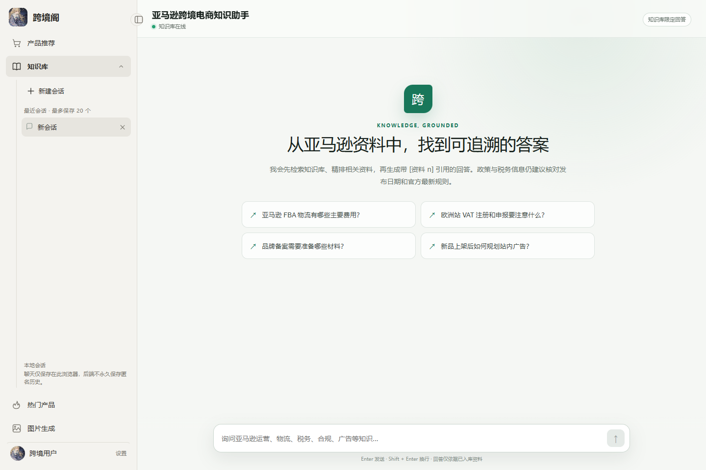
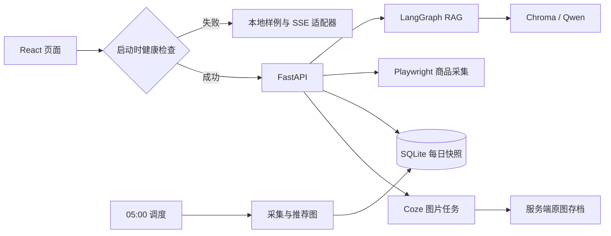
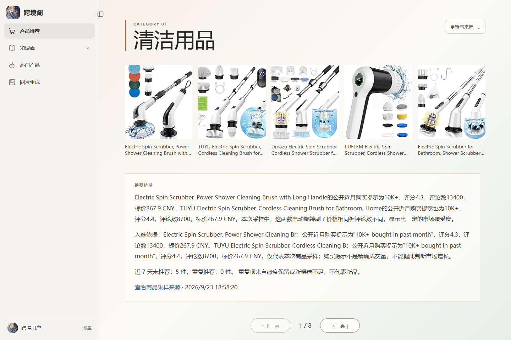
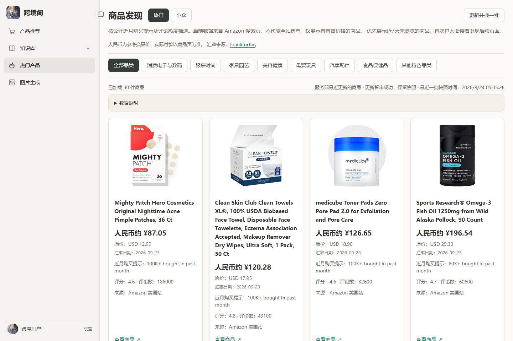
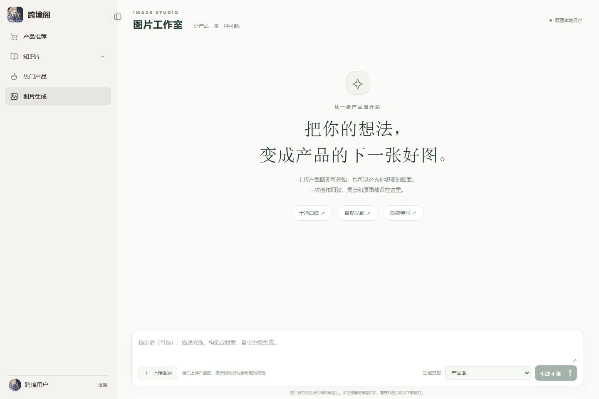

# 跨境阁 · 跨境电商 AI 工作台

[在线体验](https://ruoxiao00.github.io/kuajing/) · [备案后连接指南](docs/pages-auto-connect.md) · [本地配置手册](docs/local-development.md)

React + FastAPI 全栈项目，将跨境运营知识问答、商品发现、每日推荐和产品图片创作放在同一个工作台中。重点实现可追溯的 RAG 回答、可恢复的后台任务，以及有明确边界的前端交互。

**在线站点优先连接真实后端；无法连接时自动展示内置样例。** 顶部会标明展示模式，样例商品、预置问答和 SVG 场景插画均不代表实时市场数据或 AI 现场生成结果。无需登录或填写密钥即可体验展示版。



## 可以体验什么

| 页面 | 展示模式 | 接通后端后的完整版 |
| --- | --- | --- |
| 产品推荐 | 8 类选品样例、类别切换、来源悬浮层 | 北京时间每天 05:00 生成；SQLite 保存快照，刷新只读结果 |
| 热门产品 | 96 件模拟商品、筛选、下滑分页、示例汇率换算 | Playwright 本机采集、ASIN 去重、价格校验与人民币换算 |
| 知识库 | 4 组预置 SSE 回答、引用卡片、多会话、停止生成 | LangGraph 编排问题改写、Chroma 检索、精排和 Qwen 回答 |
| 图片工作室 | 四张预制插画，支持放大、下载、参考图本地预览 | 产品图上传 → Coze 工作流 → 四图存档与历史查看 |
| 设置 | 昵称、默认首页、侧栏和浏览偏好 | 同样保存在当前浏览器 |

展示版不上传参考图片，不请求模型、爬虫或收费生图接口。没有匹配的问题会说明演示范围；图片提示词不会改变预制插画。示例创作记录在刷新后重置，聊天和浏览偏好保存在与真实模式隔离的 localStorage 中。

## 工程实现

- **有来源的问答**：最近对话辅助改写检索问题，召回 12 个候选知识块，精排后最多 5 个进入回答上下文；无资料走条件分支，精排失败可降级。图编排用于约束工作流，并非自主规划 Agent。
- **流式聊天体验**：SSE 解析、token 分帧合并、Markdown 增量显示；上滑阅读暂停自动跟随，停止或切换会话时取消请求。
- **持久化推荐**：先采集候选再分析；按 ASIN 跨类别去重，并参考近 7 天历史轮换。周期标识与任务锁防止重复执行，完整快照事务发布，失败保留历史并在 15 分钟后补试一次。
- **图片任务恢复**：供应商密钥只在后端；请求幂等、异步状态轮询，原图下载到服务端后再提供历史与下载入口，避免只保存会过期的供应商链接。
- **自动展示兜底**：启动时通过带 CORS 校验的只读健康检查选择数据源；网络失败、超时、非 JSON 拦截页均进入展示。每分钟检查恢复，切换时重新加载，避免一段对话混入两种数据。
- **部署分离**：GitHub Actions 构建 Pages 静态前端；FastAPI 运行于 Docker，宿主 Nginx 提供 HTTPS。Hash 路由支持静态站直接打开和刷新子页面。



## 界面预览

以下截图均来自展示版，不是实际爬取商品或实际模型输出。

| 产品推荐 | 热门产品 |
| --- | --- |
|  |  |



## 本地运行展示版

需要 Node.js 22.12+。

```bash
git clone https://github.com/RuoXiao00/kuajing.git
cd kuajing
npm ci
npm run dev:demo
```

打开终端提示的地址。此模式不需要 Python、后端或任何 API 密钥。

```bash
npm run build:demo
npm run preview
```

## 本地运行完整版

需要 Python 3.13、Node.js 22.12+，以及自己配置的百炼和 Coze 凭据。完整字段、管理员账号与知识导入流程见 [本地配置手册](docs/local-development.md)。

```bash
python -m venv .venv
# Windows PowerShell：.\.venv\Scripts\Activate.ps1
# Linux / macOS：source .venv/bin/activate
python -m pip install -r backend/requirements.txt
python -m playwright install chromium
npm ci
```

首次从 `.env.example` 复制为 `.env`，不要覆盖已有配置。填写密钥与管理员配置；使用刚安装的 Chromium 时设置 `AMAZON_BROWSER_CHANNEL=chromium`。随后分别在两个终端运行：

```bash
python -m backend.run_api
```

```bash
npm run dev
```

真实模式需要配置数据来源；知识库初始为空时先导入资料。每天推荐调度需要后端持续运行，电脑或服务器关机期间不会执行。模型、生图和实际采集不属于展示版的离线行为。

## 验证

```bash
npm run lint
npm run test:frontend
npm run build:demo
```

前端测试覆盖价格和币种、快照、已浏览商品轮换、聊天存储、流式文本、示例接口、取消读取及健康检测。浏览器验收脚本：

- [verify_demo.py](scripts/verify_demo.py)：离线兜底、商品分页、预置 SSE、四图放大/下载、移动布局，以及模拟真实服务恢复。
- [verify_pages.py](scripts/verify_pages.py)：Hash 子路径刷新、同站跨域 Cookie 和图片历史；用临时服务和供应商替身，不写正式数据库。

## 部署与自动连接

默认 Pages 构建使用 `auto`，后端地址为 `https://api.qiyuange.online`。真实服务连通后，新打开或刷新页面会自动使用真实接口；后台恢复检测不会打断已经开始的输入。已经提交的真实生图或问答失败，会明确报错，不会偷偷改成样例“成功”。

`github.io` 与业务域名属于不同站点，真实图片历史及管理员登录使用 Strict Cookie，需要通过 `app.qiyuange.online` 的 Pages 自定义域名访问；仅添加 CORS 不能解决 Cookie 的同站限制。

[自动连接的服务器命令与域名配置](docs/pages-auto-connect.md) 包含一次性配置、验证及回退方式。展示入口可独立使用，尚未配置好的线上能力不视为已部署完成。

## 代码导航

| 路径 | 内容 |
| --- | --- |
| `src/compoment/zhishiku/` | 流式聊天、会话存储与 Markdown |
| `src/compoment/remeng/` | 商品分页、缓存、已浏览记录和价格换算 |
| `src/compoment/tuijain/` | 每日快照展示与类别切换 |
| `src/compoment/tupian/` | 上传、任务状态、图片历史与下载 |
| `src/runtime.js` / `src/demo/` | 自动探测、样例数据与接口适配 |
| `backend/zhishiku/` | RAG 图、文档入库、检索与管理接口 |
| `backend/tuijian/` | 推荐图、定时任务与 SQLite |
| `backend/remen/` | 商品采集与首屏快照 |
| `backend/tupian/` | Coze 调用、图片任务与原图存档 |
| `deploy/` / `.github/workflows/` | Docker、反向代理与 Pages 发布 |

公开仓库仅包含源码、配置模板与展示样例；真实密钥、知识资料、数据库、用户图片和运行日志不提交。
