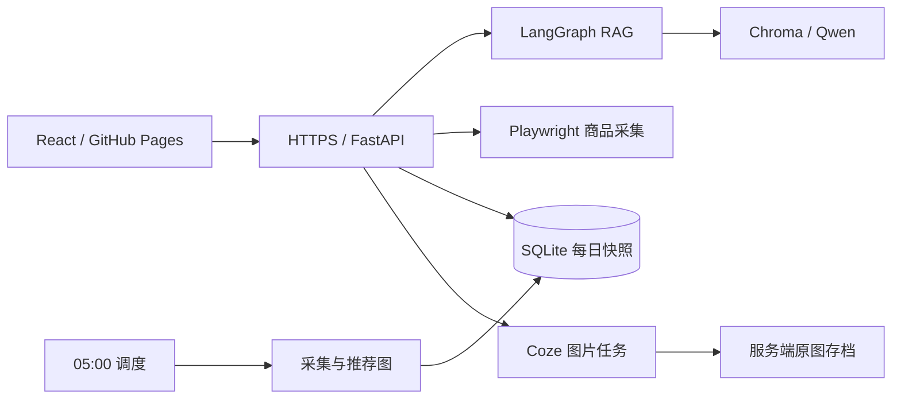

# 跨境阁 · 跨境电商 AI 工作台

[在线访问](https://app.qiyuange.online/) · [管理员登录](https://app.qiyuange.online/#/admin) · [本地运行](docs/local-development.md) · [部署说明](docs/pages-auto-connect.md)

React + FastAPI 全栈项目，将跨境运营知识问答、商品发现、每日推荐和产品图片创作放在同一个工作台中。重点实现可追溯的 RAG 回答、可恢复的后台任务，以及清晰的加载与失败状态。

**线上页面仅连接真实后端，不使用样例兜底。** 后端不可用时显示实际错误；已有商品快照可以继续浏览，但会标明更新时间。管理员入口需要登录，普通访客无法上传或修改知识库。

## 页面入口

| 页面 | 链接 | 功能 |
| --- | --- | --- |
| 产品推荐 | [打开](https://app.qiyuange.online/#/tuijian) | 定时生成的推荐快照、类别切换、分析与资料来源 |
| 热门产品 | [打开](https://app.qiyuange.online/#/remeng) | 商品筛选、下滑分页、有效价格校验与人民币换算 |
| 知识库 | [打开](https://app.qiyuange.online/#/zhishiku) | 带资料引用的流式问答、会话管理 |
| 图片工作室 | [打开](https://app.qiyuange.online/#/tupian) | 产品参考图、Coze 工作流、四图存档与下载 |
| 管理后台 | [登录](https://app.qiyuange.online/#/admin) | 管理员登录、文档上传和知识库统计 |

## 界面预览

以下截图来自线上真实页面。商品展示已保存的采集结果；知识库与图片工作室截图展示页面入口，不以预置回答或插画充当真实模型输出。数据和服务状态可能随时间变化。

| 产品推荐 | 热门产品 |
| --- | --- |
|  |  |


## 工程实现

- **有来源的问答**：最近对话辅助改写检索问题，召回 12 个候选知识块，精排后最多 5 个进入回答上下文；无资料走条件分支，精排失败可降级。LangGraph 用于约束工作流。
- **流式聊天体验**：SSE 解析、token 分帧合并、Markdown 增量显示；上滑阅读暂停自动跟随，停止或切换会话时取消请求。
- **持久化推荐**：先采集候选再分析；按 ASIN 跨类别去重，并参考近 7 天历史轮换。周期标识与任务锁防止重复执行，完整快照事务发布，失败保留历史并在 15 分钟后补试一次。
- **图片任务恢复**：供应商密钥只在后端；请求幂等、异步状态轮询，原图下载到服务端后再提供历史与下载入口，避免只保存会过期的供应商链接。
- **部署分离**：GitHub Actions 构建 Pages 静态前端；FastAPI 运行于 Docker，宿主 Nginx 提供 HTTPS。Hash 路由支持静态站直接打开和刷新子页面。



## 数据更新与可用性

- **产品推荐**：后端在北京时间每天 05:00 开始生成。页面刷新只读取快照，不触发模型和抓取。更新失败时保留最近可用结果，并显示失败说明和实际生成时间。
- **热门产品**：优先显示最近保存的首屏，后台获取最新数据，下滑时按页继续采集。来源限流、验证码或网络故障可能导致新数据暂时不可用；保留旧商品不等于本次更新成功。
- **知识库**：数据不随源码上传。部署后需要导入资料或迁移已有向量库；空库不会生成无依据的回答。迁移方式见 [运行手册](docs/local-development.md#已有知识库迁移)。
- **图片生成**：至少上传一张产品图，提示词可选；真实提交会调用已配置的工作流。历史与下载依赖当前浏览器 Cookie。

## 本地运行完整版

需要 Python 3.13、Node.js 22.12+，以及自己配置的百炼和 Coze 凭据。完整配置和知识导入流程见 [本地运行手册](docs/local-development.md)。

```bash
git clone https://github.com/RuoXiao00/kuajing.git
cd kuajing
python -m venv .venv
# Windows PowerShell：.\.venv\Scripts\Activate.ps1
# Linux / macOS：source .venv/bin/activate
python -m pip install -r backend/requirements.txt
python -m playwright install chromium
npm ci
```

首次从 `.env.example` 复制为 `.env`，填写后端凭据和管理员配置，不要覆盖已有配置。使用刚安装的 Chromium 时设置 `AMAZON_BROWSER_CHANNEL=chromium`。分别在两个终端运行：

```bash
python -m backend.run_api
```

```bash
npm run dev
```

默认本地前端通过 Vite 代理访问 8000 端口。每日推荐需要后端持续运行。

## 验证

```bash
npm run lint
npm run test:frontend
npm run build
```

前端测试覆盖价格和币种、快照、商品轮换、聊天存储及流式文本。[Pages 浏览器验收脚本](scripts/verify_pages.py) 使用临时服务和供应商替身检查子路径刷新、同站跨域 Cookie 和图片历史，不写正式数据库。

项目内保留 `npm run dev:demo` 作为本地离线交互测试工具；GitHub Pages 发布流程固定真实模式，不部署该工具的样例内容作为业务数据。

## 部署

前端：`https://app.qiyuange.online`，由 GitHub Pages 托管。
后端：`https://api.qiyuange.online`，由 Docker + Nginx 提供服务。

真实图片历史及管理员登录使用 Strict Cookie，通过同一主域名下的 app / api 子域名访问。[部署说明](docs/pages-auto-connect.md) 包含 CORS、域名、健康检查及数据迁移入口。HTTPS 可访问与备案状态是不同事项，生产可用性应分别验证。

## 代码导航

| 路径 | 内容 |
| --- | --- |
| `src/compoment/zhishiku/` | 流式聊天、会话存储与 Markdown |
| `src/compoment/remeng/` | 商品分页、缓存、已浏览记录和价格换算 |
| `src/compoment/tuijain/` | 每日快照展示与类别切换 |
| `src/compoment/tupian/` | 上传、任务状态、图片历史与下载 |
| `backend/zhishiku/` | RAG 图、文档入库、检索与管理接口 |
| `backend/tuijian/` | 推荐图、定时任务与 SQLite |
| `backend/remen/` | 商品采集与首屏快照 |
| `backend/tupian/` | Coze 调用、图片任务与原图存档 |
| `deploy/` / `.github/workflows/` | Docker、反向代理与 Pages 发布 |

公开仓库只保存项目源码、配置模板、测试及必要的运行说明；真实密钥、知识资料、数据库、用户图片和运行日志不提交。
